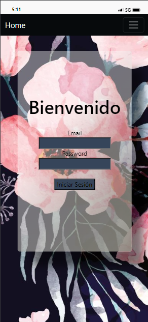

<h3 align="center">Proyecto-Final-Frontend</h3>

---

## 🧐 About 

Este es el diseño Frontend de una aplicación para crear y administrar listas de tareas, con vista de login, registro, proyectos y litas de tareas, se pueden hacer modificaciondes y relacionar listas con proyectos y usuarios.

Backend: (https://github.com/Cesarparada/Proyecto_Final_Backend.git)

### PrevieW

Vista de la navegación de la pagina.

- 
---
- 
---
- 

### Instalación

- Clonamos este repositorio.
- Instalamos las dependencias: npm install
- Iniciamos el servidor: npm run dev

## 🎈 Como utilizarlo 

- Nos registramos como usuarios.
- Nos logeamos como usuarios.
- Creamos una cita com usuarios y se nos permite, modificar y eliminar.

## ⛏️ Built Using 

- React.
- Bootstrap.
- HTML.
- CSS - sass.

## ✍️ Authors 

- [@Cesarparada](https://github.com/Cesarparada) 

## Agradecimientos:

Agradezco al profesor:

- **_Prof. Fidel Guilart_**

## Contacto

**_César Parada_**  

